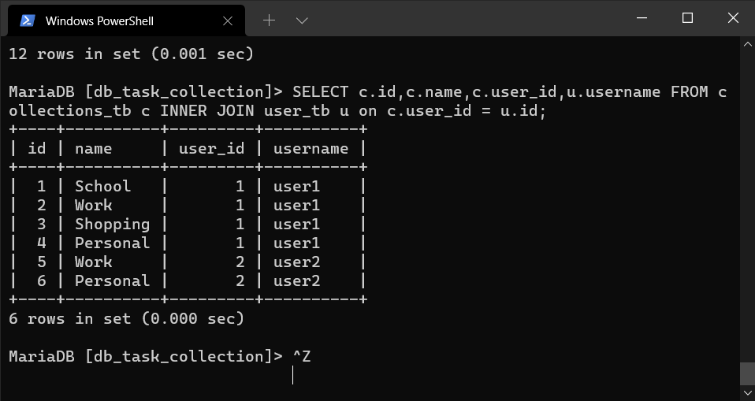
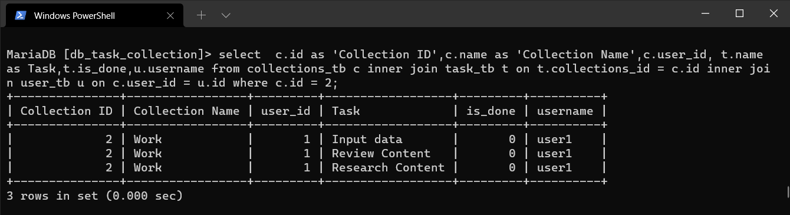
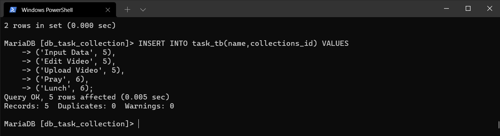

# Query Mysql

- Show Query results
   - all collections data with owner
        
   - all task data based on certain collection
        
   - specific data collections with task and username of owner
        
- POST result
   